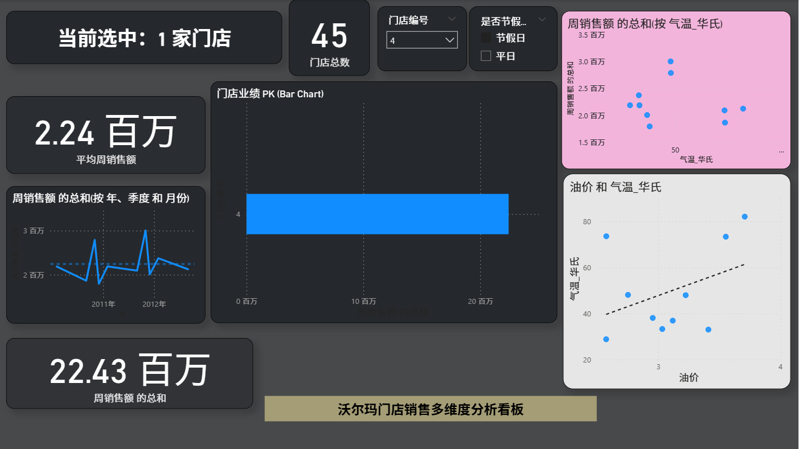

# 🛒 沃尔玛全球零售业务动态决策支持系统
> **Walmart Global Retail Sales Dynamic Decision Support System: From Raw Data to Executive Insight**


---

## 📸 看板全景预览 (Dashboard Preview)


---

## 📖 项目背景 (Background)
在复杂的全球零售环境中，销售表现受节假日、宏观经济波动及气候变迁的多重驱动。本项目通过对沃尔玛 45 家门店的历史销售记录进行深度挖掘，构建了一套全链路 BI 决策方案，旨在将杂乱的 CSV 数据转化为能够辅助管理层进行库存预警与策略调整的动态洞察。

---

## 🎨 视觉设计演变 (Design Evolution)
*本项目的核心亮点之一在于其从“默认工具感”向“大厂产品感”的视觉蜕变：*

* **色彩哲学 (Color Strategy):** 弃用了传统的白底风格，采用 **#111827 (深碳蓝)** 作为画布背景。这种“暗黑模式”能显著降低长时间数据审查的视觉疲劳，并让核心指标呈现出“自发光”的高级感。
* **对比逻辑 (Contrast):** 建立以 **#3B82F6 (科技蓝)** 为销售主色，以 **#F59E0B (琥珀金)** 为宏观环境因子（如失业率）的对比色体系，引导用户瞬间捕捉关联性。
* **UI/UX 优化:** * **毛玻璃效果:** 为卡片图增加了微弱的浅色边界线和外阴影，模拟浮动玻璃质感。
    * **极简主义分割:** 利用 **2px 宽度的亮色线段** 替代传统的粗重框架，在物理空间上完美划分“动态标题区”与“数据内容区”。

---

## 🛠️ 技术实施核心 (Technical Highlights)

### 1. 健壮的数据治理 (Data Engineering)
* **自动化异常修复:** 编写 Python 脚本解决原始 CSV 的编码乱码及日期格式非标问题。
* **特征工程扩展:** 手动提取了 `Season`, `Is_Holiday`, `Month` 等维度，并对 CPI、油价等宏观指标进行标准化处理，确保多维下钻时的逻辑对齐。

### 2. 精密的 BI 建模 (DAX Modeling)
* **动态上下文引擎:** 编写 DAX 度量值实现标题随筛选器状态实时响应（例如：标题随选定门店 ID 自动更新）。
* **同步切片逻辑 (Sync Slicers):** 实现了跨页面的决策上下文同步，用户在切换视图时无需重复筛选门店。
* **双轴关联视图:** 创新性采用双轴图分析“销售额 vs 失业率”，直观揭示外部环境对业绩的实时冲击。

---

## 📊 深度洞察与决策建议 (Insights & Action)

| 核心发现 | 数据支撑 | 建议行动 |
| :--- | :--- | :--- |
| **反周期韧性** | 失业率每上升 1%，销量波动 <1.5% | 验证了平价零售的防御属性，建议经济下行期维持现状。 |
| **节假日爆发** | 超级碗/感恩节期间周销量溢价达 8%-12% | 建议提前 14 天进入物流备货期，重点补货高频品类。 |
| **极端气候响应** | 低温下（<40°F）部分门店客流下滑显著 | 触发线上配送优惠券精准推送，以对冲线下流量缺口。 |

---

## 📂 仓库结构 (Repository Structure)

```text
├── 沃尔玛销售分析.pbix         # 包含完整 DAX 模型与可视化 UI 的源文件
├── Walmart_Sales.ipynb      # Python 数据清洗与特征提取源码 (Jupyter)
├── 沃尔玛销售数据_清洗后.csv    # 经过 ETL 处理的标准结构化数据集
├── Preview.png              # 看板全屏高清截图
└── README.md                # 项目详细说明文档
